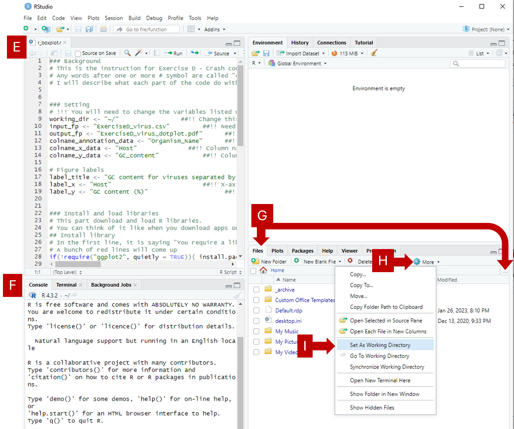

Plotting and basics in R
------------------------

Background
~~~~~~~~~~
Glossery
^^^^^^^^
* *Console*: The text-based interfact that allows you to run code. Helpful messages running code (for examples, warnings or errors) also show up in the console.
* *Path*: The specific location of a file or folder. It's like an address in the computer.
* *Working directory*: The folder your coding environment is working from. Everything you tell the computer code to do will be relative to that location. For example, if you tell the code to "make a file called abc.txt", the computer code will make it in the working directory. If you tell the code to "read a file called xyz.txt", the computer code will look for this file in the working directory.
* *Package/library*: In R, packages are a collection of code and data, a bit like a phone App. The location where the packages are stored is referred to as a library.
* *Comments*: In R, text after # are treated as comments. They provide readable explaination/annotatio. It's important to develope a habbit of writing comments regularly, as they help others, and your future self, understand what the code is aiming to do.
* *Objects/variables*: Objects (usually called variables in other programming languages) are used to store information. They allow for a name to be associated with each piece of information. You can kind of think of them as little containers with labels, each holding a piece information you have asked the computer to remember (for example, a number or a table).
* *Function*: A block of code that can perform a specific task. For exampl, "mean" is a function in R that can be used to calculate the mean of a bunch of numbers.

Shortcut keys 
^^^^^^^^^^^^^
You can save files using these shortcut keys:

* [ Ctrl ] + [ S ] (Windows)
* [ Cmd ] + [ S ] (Mac)


Task 1. Install R and RStudio
~~~~~~~~~~~~~~~~~~~~~~~~~~~~~
[upperalpha]
. Install R https://cran.rstudio.com/[^]. 
. Install RStudio https://posit.co/download/rstudio-desktop/[^].
. The first time you open RStudio, it might ask you to select a specific version of R. It should automatically highlight on a version if you already installed R. If not, make sure you go to the first step to download and install R.


Task 2. Example code
~~~~~~~~~~~~~~~~~~~~
Task 2.1. Download files and setup
^^^^^^^^^^^^^^^^^^^^^^^^^^^^^^^^^^
Before going into details on how to write code in R, we will first take a look at an example pieces of code that can be used to make plots. 

[upperalpha]
. Download *r_boxplot.r*.
. Download *data_eukaryote.csv*.
. Create a folder specifically for this exercise. Create a folder named *data*
. Move the downloaded files into a folder named *data* in your folder.
. Open *r_boxplot.r* in RStudio. It should appear in the top left corner.
. You can find the [ *_Console_* ] tab at the bottom left corner.
. Click on *Files* tab in the bottom right corner, then click on [ ... ] at the right-hand side. Go to the folder where the downloaded files were moved to in Step C-D and click on [ Open ].
. Click on [ More ].
. Click on [ Set As Working Directory ].
. Notice that *_Console_* (Step F) now shows a new line. It should look something like.
+
[source,r]
-----------------
setwd("C:/Users/username/exercise_folder")
-----------------
. The text between the quotation marks "" is the *_path_* to the folder you want to work from. *_Working directory_* is the folder you are working from. 




Task 2.2. Adapt the downloaded code
^^^^^^^^^^^^^^^^^^^^^^^^^^^^^^^^^^^

[upperalpha]
. Change Line 9 in *r_boxplot.r*. Replacce the text between "" with the *_path_* your *_working directory_*. Notice that there are *_comments_* after # symbols; these are descriptive texts not used by R.
. Click on the [ Run ] button in the top left panel. You can also click anywhere in the *r_boxplot.r* file and press [ Ctrl ] + [ Enter ].
. You might see a lot of red lines wizzing past in the bottom left panel. It's the program trying to download tools that are needed in this script. Wait until everything finishes.
. Once the code has finished running, you should get an interactive graph that you can hover over the points. You can find out which viruses have a very high or very low GC content. This plot is made with the *plotly*, which is an R *_package_*.
. Take a look at your working directory now, there should now be a new file named *boxplot_virus.pdf*. This plot is made with *ggplot2*, which is an R *_package_*.
. Go back and read line 9-21. 
. Take a look at the column names for *data_virus.csv* and *data_eukaryote.csv* in Excel; do they look identical?
. Try and change line 9-21 so that you can plot with the input file *data_eukaryote.csv*.
. Try and make plots using r_dotplot.r instead.


Task 3. Back to basics
~~~~~~~~~~~~~~~~~~~~~~
The purpose of jumping straight into code editing in the examples above is so that you experience code editing and reading *_comments_*. 

Task 3.1. Try using R like a calculator
^^^^^^^^^^^^^^^^^^^^^^^^^^^^^^^^^^^^^^^
[source,r]
-----------------
# Try using R like a calculator
1 + 2
1 * 2
8 / 2
10^4
-----------------


Task 3.1. What happens when you type letters?
^^^^^^^^^^^^^^^^^^^^^^^^^^^^^^^^^^^^^^^^^^^^^
[source,r]
-----------------
# What happens when you type in letters instead of numbers?
x
-----------------

Q1. What does the error you get from typing "x" mean?

[%collapsible]
====
The error message "Error: object 'x' not found" means that R cannot find an object called x. When you see this error and you know that the object should be there, check that you haven't spelt it wrong (common mistakes are: missing a underscore, having an extra space, incorrect capitalisation) . In this case, the object isn't there.
====

Q2. Try adding a # before typing letters, what happens?

[%collapsible]
====
R ignores everything that comes after a #. It is considered to be a comment. Comments are extremely useful and your future-self will thank you for making good comments.
====


Task 3.2. Making objects (variables)
^^^^^^^^^^^^^^^^^^^^^^^^^^^^^^^^^^^^
We can store information in R as *_objects_* (usually referred to as variables in other programming language). You can make objects in R by using back arrows; this is made of 2 keyboard keys, lesser than symbol [ < ] and dash [ - ]. You can also just use the = symbol in most situation.

```r
# "Objects" in R are usually called "variables" in other programming languages
a <- 100
b <- 200
a + b

# You can overwrite existing objects
a <- 1
a + b

# You can use the object in the process of overwriting it
a <- a + 1
a
a <- a + 1
a

# Your object name can be more descriptive
# This is important when you write longer pieces of code
# because short object names like a and b will quickly get confusing
very_long_name <- 1000
a + very_long_name
```

Task 3.3. Naming objects (variables)
^^^^^^^^^^^^^^^^^^^^^^^^^^^^^^^^^^^^
Do:

* Be descriptive 
* Follow a naming style (for example, camelCase and snake_case)

Avoid:

* Spaces in your names
* Names starting with a number (R doesn't like this)
* Special characters (like $!@)
* Short names like "mean". They can be a special name already taken up by R default *_functions_*


```r
# Assign the cost for different foods into objects
apple <- 0.5
chocolate_bar <- 0.9
tuna_sandwich <- 5.5

# You can add these objects together
my_lunch <- apple + chocolate_bar + tuna_sandwich
my_lunch
```


Task 3.4. Numbers vs letters
^^^^^^^^^^^^^^^^^^^^^^^^^^^^
```r
# Anything between quotation marks are treated as letters, regardles if they are numbers or letters
# Try the code below
apple <- "0.5"
chocolate_bar <- "0.9"
apple + chocolate_bar
```
Q: Did you get an error? If you did, what went wrong? If you did not, check what is different between the code you have typed and the code above.

[%collapsible]
====
This error is saying that the values you tried to add together are not numbers. Check that your objects are numeric by using class(chocolate_bar). Sometimes things can look like numbers, but R thinks they are not. This can be a problem when you import data where part of the column has characters like "NaN" instead of numbers.
====


Task 3.5. Combine words
^^^^^^^^^^^^^^^^^^^^^^^
```r
# You can stick words together using paste
item1 <- "apple"
item2 <- "chocolate bar"
paste("lunch:",  item1, item2)

# Paste is a function
# You can check more details on functions by typing
?paste

# The documentation from this might be a bit confusing to read for now. Try out the following code. What do you think "sep" in this function is doing? Try changing it to something else.
paste("lunch:", item1, item2, sep="  !!  ")

```


Task 3.6. Functions
^^^^^^^^^^^^^^^^^^^^^^^
```r
# There are many inbulit R function
# paste and paste0 are examples that we have used so far.
# Let's create a simple function
describe_item_cost <- function(input_item, input_cost){
	paste(input_item, "cost", "£", input_cost)
}
describe_item_cost(input_item = "apple", input_cost= "1.50")

# You can skip out stating the variable names by giving the input in the correct order
describe_item_cost("oranges", 3)

```